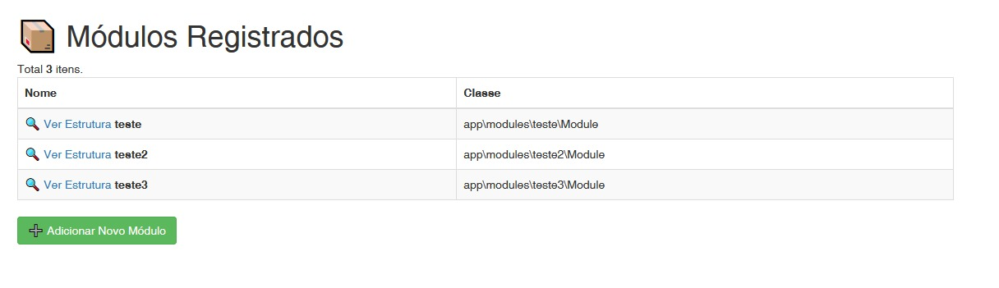
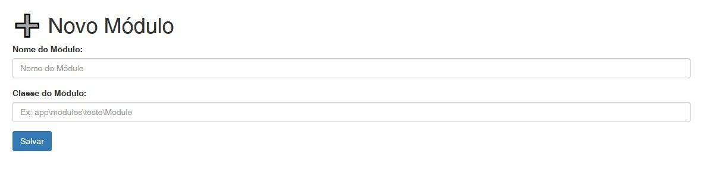
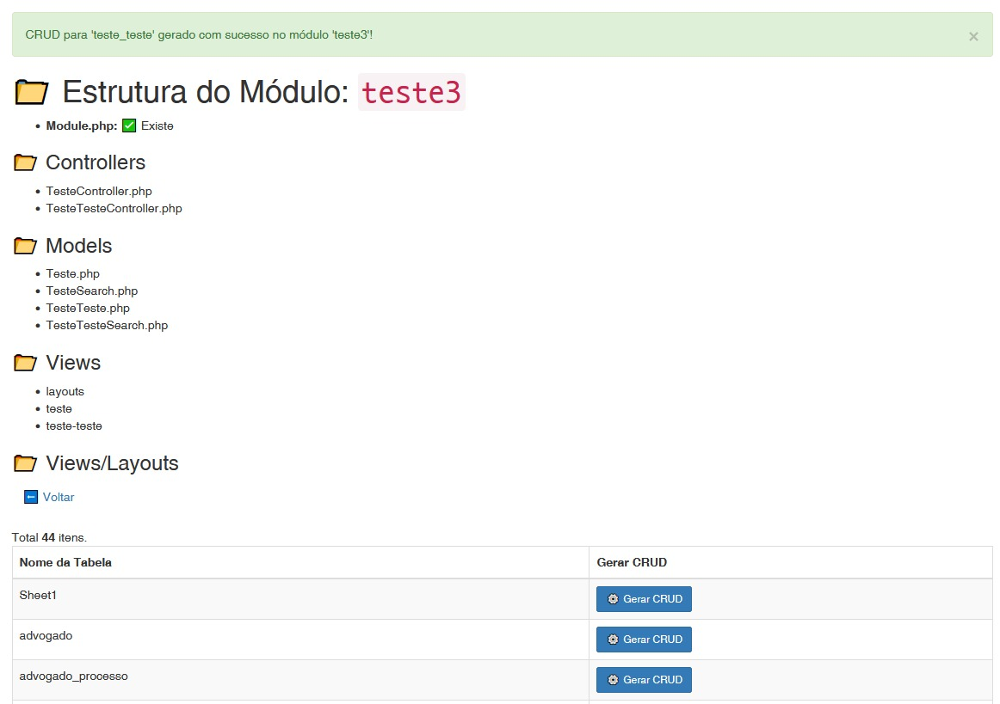

# yii2-modulo-admin

Este é um painel de administração de módulos para projetos em Yii2.

### Funcionalidades

- 📦 Lista todos os módulos registrados (`config/modules.php`)
- ➕ Permite adicionar novos módulos via interface
- 🔍 Visualiza a estrutura de cada módulo:
  - Module.php
  - Controllers
  - Models
  - Views
  - Layouts
- ⚙️ Exibe o conteúdo do `config/web.php`

### Instalação via Composer (repositório Git)

```bash
composer config repositories.yii2-modulo-admin vcs https://github.com/kairiroberto/yii2-modulo-admin
composer require roberto/yii2-modulo-admin:dev-main
```

### Instalação via app\modules
Baixa 'controllers/ModuloController.php', 'views/modulo/add.php', 'views/modulo/index.php', 'views/modulo/view.php' e Module.php, corrigir os namespace das classes ModuloController e Module, finalmente, configurar o modulo no config/web.

### Ativação no Yii2

No arquivo `config/web.php`, registre o módulo:

```php
'modules' => [
    'moduloadmin' => [
        'class' => 'roberto\\moduloadmin\\Module',
    ],
],
```

Ou, fora do array diretamente:

```php
$config['modules']['moduloadmin'] = [
    'class' => 'roberto\\moduloadmin\\Module',
];
```

### Configuração Inicial

```bash
# Crie o arquivo de módulos se não existir
nano config/modules.php
```

Conteúdo:
```php
<?php
return [];
```

```bash
# Garanta que a pasta de sessões existe e tem permissão
mkdir -p runtime/sessions
chmod -R 777 runtime/sessions
```

### Execução

```bash
php yii serve
```

Acesse no navegador:
```
http://localhost:8080/index.php?r=moduloadmin/modulo/index
```

### Uso

1. Clique em "Adicionar Módulo"
2. Informe:
   - Nome do módulo (ex: `teste`)
   - Classe do módulo (ex: `app\\modules\\teste\\Module`)
3. Clique em "Ver Estrutura"
4. O sistema criará:
   - `modules/teste/`
   - `Module.php`
   - Subpastas padrão: `controllers/`, `models/`, `views/layouts/`

---

### Telas






Se quiser gerar automaticamente um `Controller` ou uma `View` base, abra uma issue ou envie um PR. ♥️

